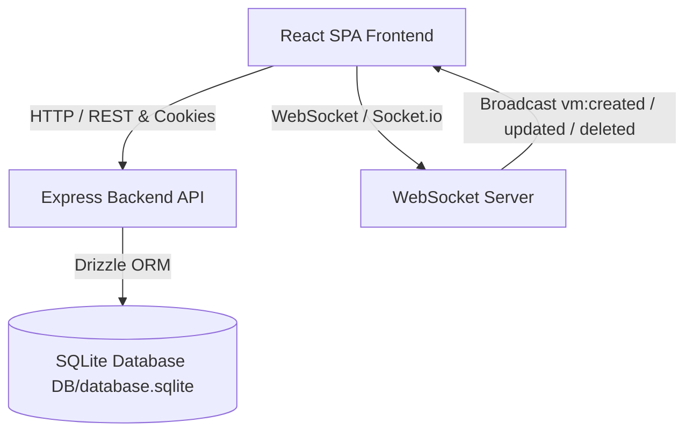

# IFX Cloud Virtual Machine Manager (Full-Stack SPA)

A high-performance, modern Single Page Application (SPA) for managing Virtual Machines (VMs) built with **React (TypeScript)** and **Tailwind CSS** on the frontend, and **Node.js (Express) + Socket.io** with **SQLite (Drizzle ORM)** on the backend. Fully containerized with **Docker** and **Docker Compose**.

---

## 🚀 Key Features

### 🖥️ Frontend (React, TypeScript & Tailwind CSS)
- **Modern UI & Dark Mode**: Sleek glassmorphism aesthetic with native light and dark mode toggling via sun/moon icons (persistent in localStorage).
- **Universal Header/Menu**: Consistent top navigation bar featuring the "Main Page" tab, dark mode toggle, user role badge, and secure logout.
- **Data Visualization**: Dedicated `Chart.js` panel displaying aggregate active VM resource allocation (CPU cores, RAM, and Disk) with real-time stats.
- **Role-Based Access Control (RBAC)**:
  - **Administrator**: Full CRUD permissions (create, edit, delete, start/stop VMs).
  - **Client**: Read-only access where creation, modification, and deletion buttons are **completely hidden** (not just disabled).
- **Optimistic UI & Feedback**: Immediate UI response on CRUD actions with automatic rollback on error, skeleton loaders, and interactive toast notifications.
- **Real-Time WebSockets**: Instant synchronization across connected clients using `Socket.io` with subtle flash highlight animations when VMs are updated or created.

### ⚙️ Backend (Node.js, Express & WebSockets)
- **Secure Authentication**:
  - JWT tokens are stored securely in `HttpOnly`, `SameSite=Lax`, and `Secure` (in production) cookies (never exposed to `localStorage`).
  - `POST /login`: Validates credentials, sets HttpOnly cookie, and returns user profile & role.
  - `POST /logout` & `GET /api/auth/me`: Session management.
- **RESTful Endpoints**:
  - `GET /api/vms`: List all VMs (Admin & Client).
  - `POST /api/vms`: Create VM (Admin only).
  - `PUT /api/vms/{id}`: Update VM details or status (Admin only).
  - `DELETE /api/vms/{id}`: Delete VM (Admin only).
- **Database & Migrations**:
  - SQLite database located in `DB/` with migration files in `DB/Migrations/`.
  - Drizzle ORM for type-safe database access.

---

## 🔑 Pre-configured Test Credentials

| Role | Email | Password | Permissions |
|---|---|---|---|
| **Administrator** | `admin@mail.com` | `123` | Full CRUD, Start/Stop VMs |
| **Client** | `client@mail.com` | `123` | Read-only (Creation/Edition/Deletion hidden) |

---

## 🛠️ Local Deployment Guide

### Option 1: Running with Docker Compose (Recommended)
Make sure Docker and Docker Compose are installed, then run:
```bash
docker compose up --build
```
- **Frontend App**: [http://localhost:3000](http://localhost:3000)
- **Backend API**: [http://localhost:5000](http://localhost:5000)

### Option 2: Running Locally Without Docker

1. **Start Backend**:
   ```bash
   cd backend
   npm install
   npm run db:seed
   npm run dev
   ```
   *(Backend runs on `http://localhost:5000`)*

2. **Start Frontend (in a separate terminal)**:
   ```bash
   cd frontend
   npm install
   npm run dev
   ```
   *(Frontend runs on `http://localhost:3000`)*

---

## 📐 Architecture & Technical Decisions

### Architecture Diagram



### Folder Structure
- `DB/` & `backend/DB/`: SQLite database storage and `DB/Migrations/` SQL migration scripts.
- `backend/src/`: Express controllers, routes, auth middleware, and Drizzle schema.
- `frontend/src/`: React components (`Navbar`, `ResourcesChart`, `VmCard`, `VmModal`, etc.), context providers (`AuthContext`, `ThemeContext`, `ToastContext`), and pages (`LoginPage`, `DashboardPage`).

---

## 📝 Bitácora de IA (AI Journal)

### 1. ¿Qué herramientas de IA utilizaste?
- Gemini (via Zed AI Agent) para diseñar y redactar la arquitectura completa del proyecto, generar la estructura del monorepo, escribir la lógica backend (Express, JWT HttpOnly cookies, Socket.io, Drizzle ORM con sql.js/node:sqlite), y construir la SPA en React TypeScript con Tailwind CSS y Chart.js.

### 2. ¿Para qué partes delegaste el trabajo pesado y dónde tuviste que intervenir?
- **Delegado**: Generación inicial de la estructura de carpetas, componentes de UI con Tailwind, configuración de Chart.js, manejo de Socket.io tanto en el servidor como en el cliente, y plantillas de Dockerfile / Docker Compose.
- **Intervención humana/guía**: Ajuste preciso de los adaptadores de SQLite en Node.js (asegurando compatibilidad total con C++ / WebAssembly `sql.js` para evitar problemas de compilación nativa en entornos sandbox de Linux), validación estricta de los requisitos de rol de cliente (ocultando completamente los botones de acción en lugar de solo deshabilitarlos), y configuración de cookies HttpOnly seguras.

### 3. Muestra 1 o 2 prompts clave utilizados:
- *Prompt 1 (Backend Auth & Security)*: "Implement JWT authentication in Node.js Express where the token is NEVER returned in the body or saved in localStorage, but set as an HttpOnly, Secure, SameSite cookie. Create POST /login, POST /logout, and GET /me endpoints."
- *Prompt 2 (Frontend RBAC & Optimistic UI)*: "Create a React TypeScript VM management dashboard with Tailwind CSS. If user role is 'Client', completely hide (don't just disable) create, edit, and delete buttons. Implement Optimistic UI updates when toggling VM status or performing CRUD actions, backed by Socket.io real-time broadcast and Chart.js resource allocation summary."
