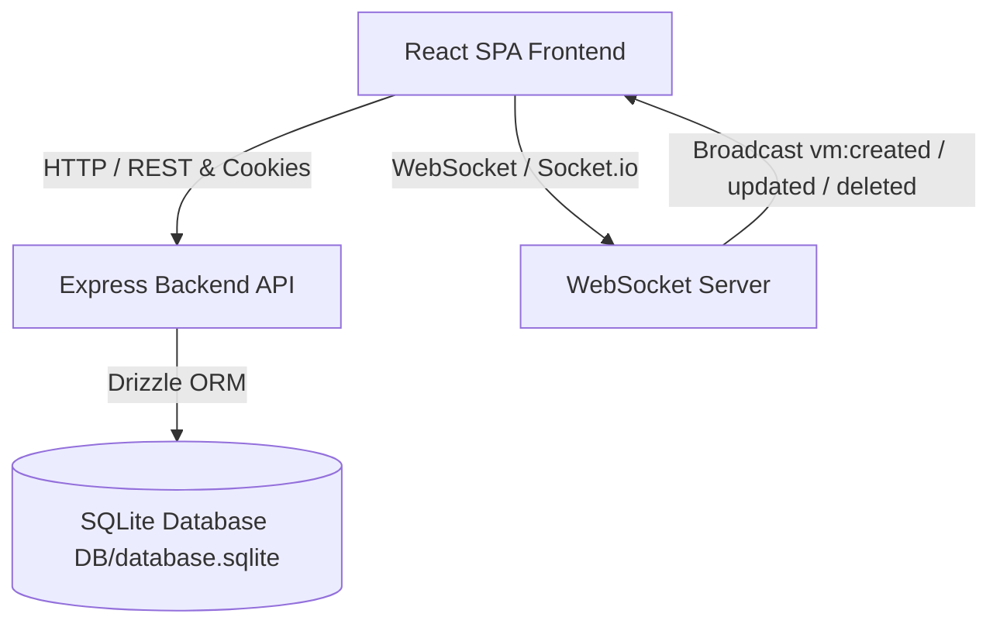

# Cloud Virtual Machine Manager (Full-Stack SPA)

A high-performance, modern Single Page Application (SPA) for managing Virtual Machines (VMs) built with **React (TypeScript)** and **Tailwind CSS** on the frontend, and **Node.js (Express) + Socket.io** with **SQLite (Drizzle ORM)** on the backend. Fully containerized with **Docker** and **Docker Compose**.

## Local Deployment Guide

### Option 1: Running with Docker Compose (Recommended)
To avoid any Docker Desktop host path sharing errors (`"path is not shared from the host"`), this project uses a **named Docker volume** (`db_data`) paired with image build-time packaging of the `DB` folder.

Simply run:
```bash
docker compose up --build
```
- **Frontend App**: [http://localhost:3000](http://localhost:3000)
- **Backend API**: [http://localhost:5000](http://localhost:5000)

### Option 2: Running Locally Without Docker

1. **Start Backend**:
   ```bash
   cd backend
   npm install
   npm run db:seed
   npm run dev
   ```
   *(Backend runs on `http://localhost:5000`)*

2. **Start Frontend (in a separate terminal)**:
   ```bash
   cd frontend
   npm install
   npm run dev
   ```
   *(Frontend runs on `http://localhost:3000`)*

## Pre-configured Test Credentials

| Role | Email | Password | Permissions |
|---|---|---|---|
| **Administrator** | `admin@mail.com` | `123` | Full CRUD, Start/Stop VMs |
| **Client** | `client@mail.com` | `123` | Read-only (Creation/Edition/Deletion hidden) |

## Architecture & Technical Decisions

### Architecture Diagram



### Techinical Decisions

The main requirements of the app would be: **Escalability**, **Design** **Security**, **Real Time Comunication**, **Multi User and roles** and **Frontend**

Now each requirements need to fullfil some the criteria.
- **Escalability:** Deployment and escalability was a fundamental part so to solve this problem I design a monorepo with docker for easy deployment, exist a symbiotic relation with kubernetes that would let us escale this app.
- **Design:** React with typescript with tailwind is a good choice on fast development and great documentation.
- **Security:** Nodejs with Express, this is a real good choice when you want REST implementation (route control with middlewares). This would let us a fine control of the access with easy JWT implentation.
- **Real Time Communication:** Nodejs got a really fast mature and up to date library that let us implement websockets for real time communication in this case Socket.io.
- **Multi User and roles:** Part of the security and app flow control is the manage and implementation of roles so it let use control the access and visibility of each user. 
- **Frontend:** 
```
└── src
    ├── components (let use create reusable components like cards and navbars)
    ├── context (React let use use the hooks context to control the Theme (dark/light), Auth and Toast)
    ├── pages (let us control the pages in the app: login, Dash board (main page))
    ├── services (API access with middlewares)
    ├── types (type script let you define the interfaces)
    └── App.tsx (Main container of the app and manage the routes with react router).
``` 

## AI Journal

### 1. ¿Which IA tools did you use?
- Gemini is really fast and powerfull.

### 2. ¿Which parts you delegate and when you had to intervene?
- **Delegate**: Generation of the dockerfile and docker compose, base sctructure of the app, if you give it a well defined prompt with the desired technologies it would execute almost flawlessly.
- **Human Intervention**: Need to intervene on which specific technologies and libraries want to use in this  project with the folder structure of the front end and the implementations of the roles. Got problems in the live update of the resources when creating or updating each VM Need to find the problem and explain it with a real example.

### 3. Show 1 or 2 key prompts:
- **Prompt 1 (live resources update)**: "The problem is in in line 90 "DashboardPage.tsx". in this line the code is this: "setVms((prev) => prev.map((v) => (v.id === editingVm.id ? optimisticVm : v)));" if you edit the last one VM the id of that VM would be set in "editingVm.id" but the "v.id" would be from the first vm of the array so it never updates".
